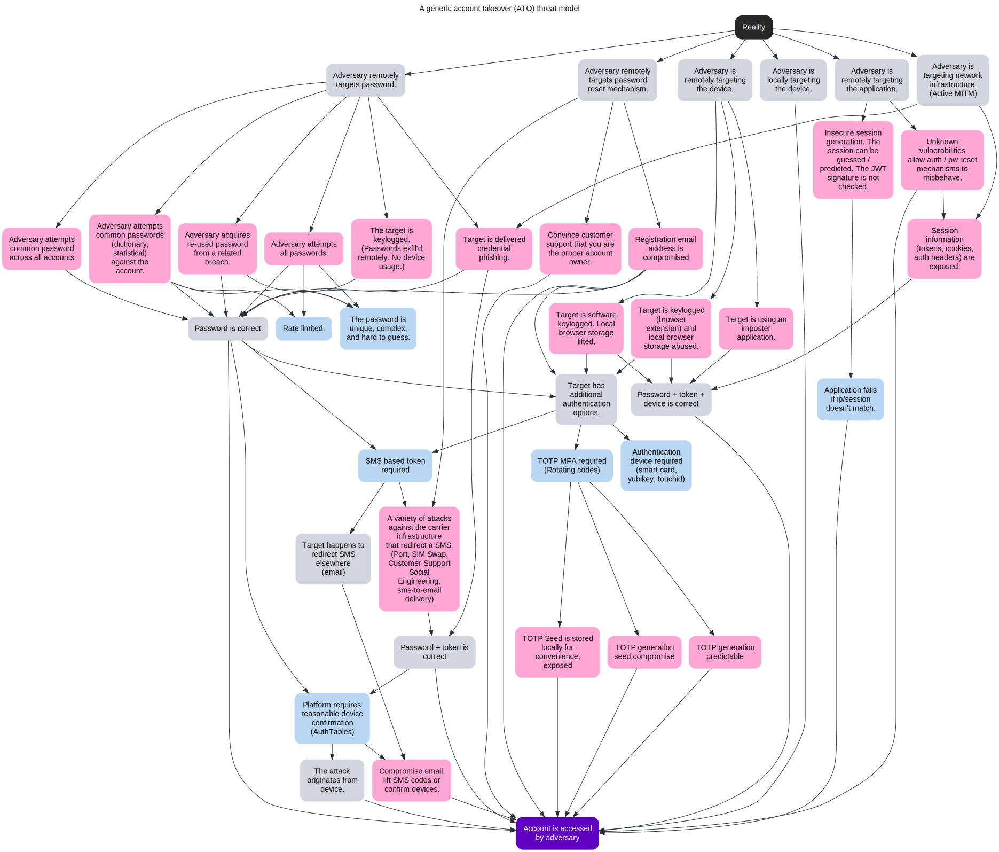

# Account Takeover (ATO) Threat Model

---

🐑🐑🐺🐑

---

### Instructions

1. Open [deciduous](https://swagitda.com/deciduous/)
2. Open [the model YAML](model.yaml)
3. Paste the model YAML into deciduous.

The output will look something like this.

Within the YAML you'll find some links to support the model. Enjoy!